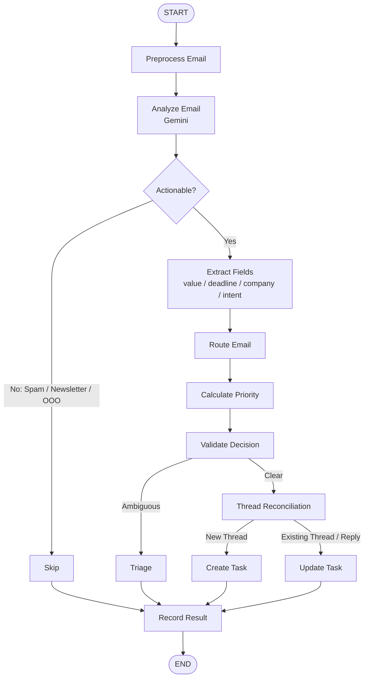

# Inbox Router — Alumnx AI Labs FDE Challenge

**candidate_id:** `nirrujogiprudhvi@gmail.com`

## Setup (3 commands)

```bash
git clone https://github.com/prudhvi-1618/InboxOps.git && cd InboxOps
cp backend/.env.example backend/.env   # fill in your keys
cd backend && npm install && npm start
```

Frontend dev:
```bash
cd frontend && cp .env.example .env.local && npm install && npm run dev
```

## Architecture

- **Backend:** Python + FastAPI, SQLite (aiosqlite)
- **Frontend:** React + Vite
- **LLM:** Gemini 3.6 Flash / 1.5 Flash via `google-genai` and LangGraph
- **Task API:** Shared grading API at `TASK_API_BASE_URL`

### LangGraph Email Workflow



## Endpoints

| Method | Path | Purpose |
|--------|------|---------|
| POST | /ingest | Classify and route a batch of emails |
| GET | /api/tasks | Proxy to shared Task API |
| GET | /api/stats | Aggregate counts from local DB |
| POST | /api/chat | NL query → SQL → Gemini phrase |
| GET | /health | Smoke-test liveness check |

## Environment variables

See `backend/.env.example` for all required vars.
